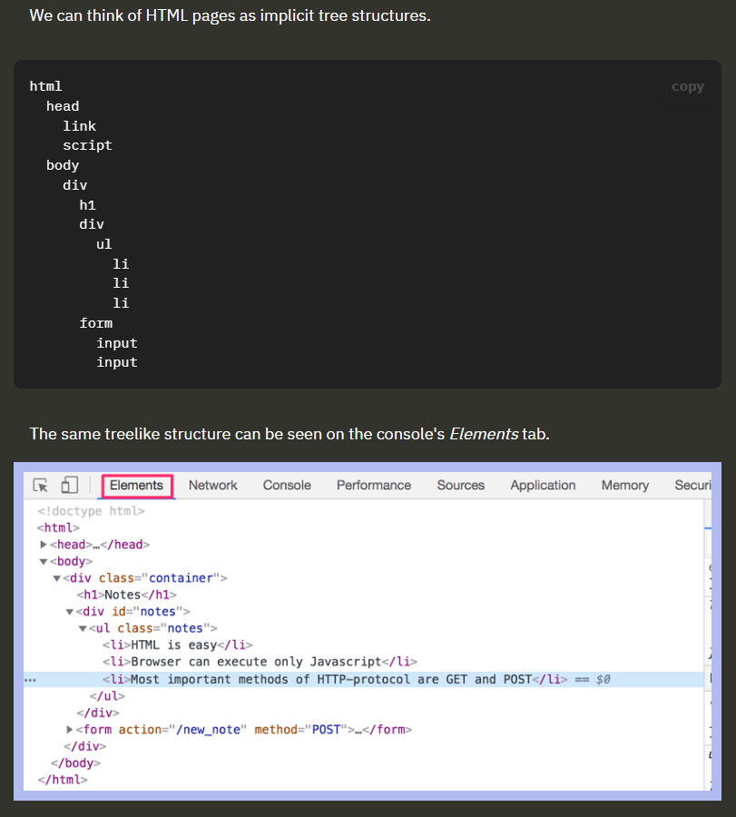

# part0.b Fundamentals of Web Apps
- JavaScript code to create new elements and injecting child into the elements
```javascript
var xhttp = new XMLHttpRequest()

xhttp.onreadystatechange = function() {
  if (this.readyState == 4 && this.status == 200) {
    const data = JSON.parse(this.responseText)
    console.log(data)

    var ul = document.createElement('ul')
    ul.setAttribute('class', 'notes')

    data.forEach(function(note) {
      var li = document.createElement('li')

      ul.appendChild(li)
      li.appendChild(document.createTextNode(note.content))
    })

    document.getElementById('notes').appendChild(ul)
  }
}

xhttp.open('GET', '/data.json', true)
xhttp.send()
```
- In the code above, the request to the server is sent on the last line, but the code to handle the response can be found further up. What's going on?
    - On this line, an _event handler_ for the event _onreadystatechange_ is defined for the _xhttp_ object doing the request. When the state of the object changes, the browser calls the event handler function. The function code checks that the [readyState](https://developer.mozilla.org/en-US/docs/Web/API/XMLHttpRequest/readyState) equals 4 (which depicts the situation _The operation is complete_) and that the HTTP status code of the response is 200.

- Chrome: On Windows or Linux, open the console by pressing _Fn_-_F12_ or _ctrl-shift-i_ simultaneously.
- Event handler functions are also called Callback functions in JS

- The _head_ element of the HTML code of the Notes page contains a [link](https://developer.mozilla.org/en-US/docs/Web/HTML/Element/link) tag, which determines that the browser must fetch a [CSS](https://developer.mozilla.org/en-US/docs/Web/CSS) style sheet from the address [main.css](https://studies.cs.helsinki.fi/exampleapp/main.css).


#### What is DOM?
- 

- In recent years, the [Single-page application](https://en.wikipedia.org/wiki/Single-page_application) (SPA) style of creating web applications has emerged. SPA-style websites don't fetch all of their pages separately from the server like our sample application does, but instead comprise only one HTML page fetched from the server, the contents of which are manipulated with JavaScript that executes in the browser.

- 
